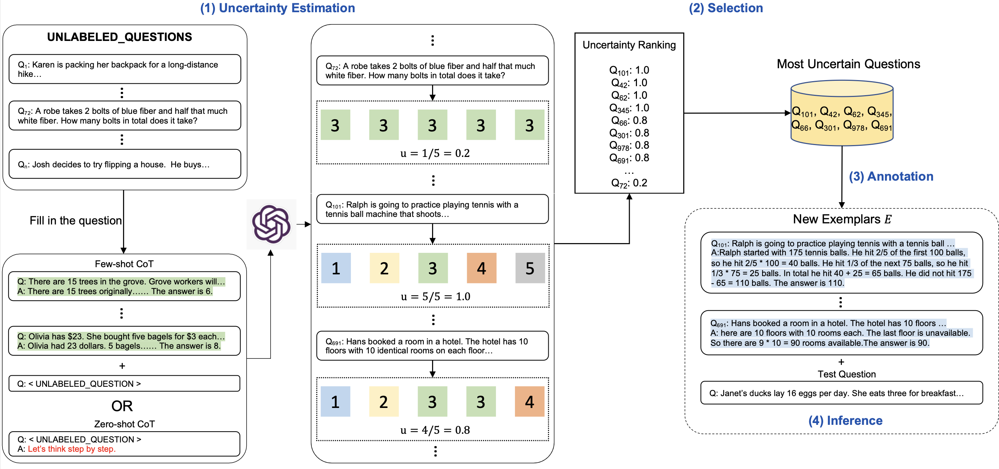
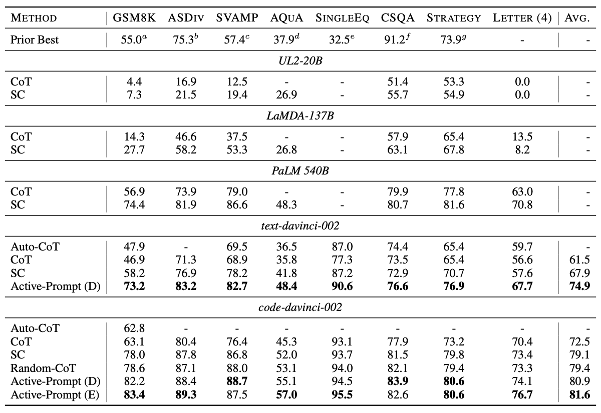

# Active-Prompt: Active Prompting with Chain-of-Thought for Large Language Models
This is the official repo of [Active Prompting with Chain-of-Thought for Large Language Models](https://arxiv.org/abs/2302.12246)

## Method
“Actively and judiciously select the most helpful questions for LLMs“

Existing CoT studies largely rely on a fixed set of human-annotated exemplars, which are not necessarily the most effective ones. A good performance requires human prompt engineering which is costly.
We identify the human prompt engineering as two complementary components: question selection and prompt template engineering. 
In this paper, we offer a solution to the key problem of determining which questions are the most important and helpful ones to annotate from a pool of task-specific queries. 
By borrowing ideas from the related problem of uncertainty-based active learning, we introduce several metrics to characterize the uncertainty so as to select the most uncertain questions for annotation. 
Experimental results demonstrate the superiority of our proposed method on eight complex reasoning tasks.
With `text-davinci-002`, active-prompt improves upon self-consistency by 7% (67.9->74.9).

The illustration of active-prompt is shown in the figure below.




## Requirements
`pip install openai`

Please put your `OpenAI API KEY` to the `API_KEY` variable of `utils.py`.

Then you are good to go : )

## Quick Start
For a quick start, you can directly run inference script with our provided prompts (proposed in the paper).

```shell
python inference.py --dataset="gsm8k" --model="code-davinci-002" --method="active_cot" --qes_limit=10 --prompt_path="./inference_prompts/gsm8k_k=10" --random_seed=42 --multipath=1 --temperature=0.7 --api_time_interval=2
```

## Reproduce Procedure
First run the uncertainty generation script to get the uncertainty for each question of the dataset
### Uncertainty Estimation
```shell
python uncertainty_estimation.py --dataset="gsm8k" --model="code-davinci-002" --method="few_shot_cot" --qes_limit=0 --prompt_path="./basic_cot_prompts/math_word_problems" --random_seed=42 --num_trails=10 --sort_by=disagreement
```

After select the most uncertain questions, you can start annotation. We provide our prompt files for your reference when you are writing your prompt file. Finally, run the inference with your prompt file.

### Run inference script
```shell
python inference.py --dataset="gsm8k" --model="code-davinci-002" --method="active_cot" --qes_limit=0 --prompt_path="YOUR_PROMPT_FILE_PATH" --random_seed=42 --multipath=40 --temperature=0.7 --api_time_interval=2
```

## Important arguments
   * `--dataset`: The name of a dataset. `choices = [gsm8k, svamp, aqua, csqa, last_letters, strategyqa, asdiv, singleeq, addsub, multiarith]`.
   * `--model`: GPT-3 model. `choices = [text-davinci-002, code-davinci-002]`.
   * `--method`: few-shot-cot or active_cot.
   * `--qes_limit`: number of test questions.
   * `--prompt_path`: path of prompt file.
   * `--num_trails`: number of trails for uncertainty estimation.
   * `--sort_by`: the metric for uncertainty estimation.
   * `--multipath`: number of paths during generation.
   * `--api_time_interval`: the time interval when requesting GPT-3 API. Suggested interval is larger than 1 second.

To reproduce the results in our paper, set `--qes_limit=0, --multipath=40`
## Contact information

For help or issues using active-prompt, please submit a GitHub issue.

For personal communication related to active-prompt, please contact Shizhe Diao (`sdiaoaa@connect.ust.hk`).

## Citation

If you use or extend our work, please cite the following [paper]((https://arxiv.org/abs/2302.12246)):
```
@misc{diao2023active,
      title={Active Prompting with Chain-of-Thought for Large Language Models}, 
      author={Shizhe Diao and Pengcheng Wang and Yong Lin and Tong Zhang},
      year={2023},
      eprint={2302.12246},
      archivePrefix={arXiv},
      primaryClass={cs.CL}
}
```
test22233 git push 